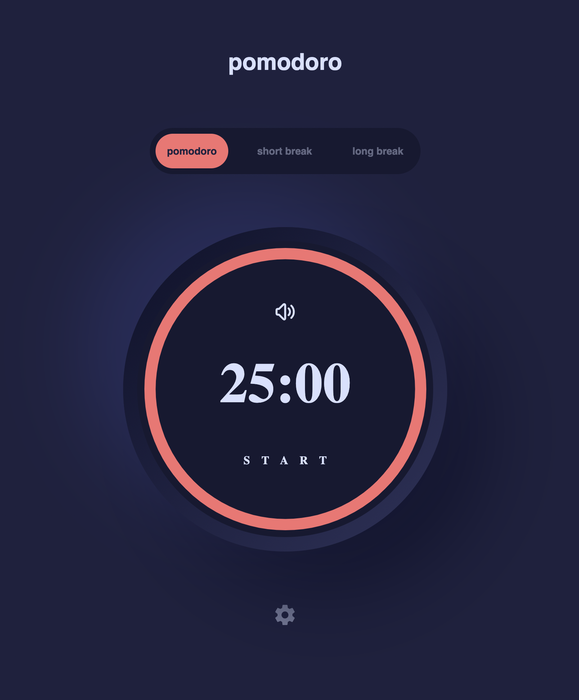
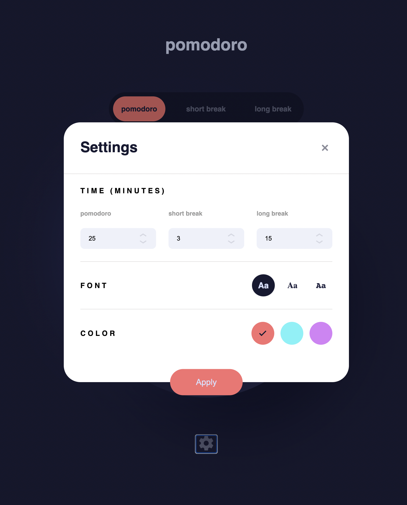

# Frontend Mentor - Calculator app solution

This is a solution to the [Pomodoro app challenge on Frontend Mentor](https://www.frontendmentor.io/challenges/pomodoro-app-KBFnycJ6G). Frontend Mentor challenges help you improve your coding skills by building realistic projects.

## Table of contents

- [Overview](#overview)
  - [The challenge](#the-challenge)
  - [Screenshot](#screenshot)
  - [Links](#links)
- [Built with](#built-with)
- [Author](#author)

## Overview

The idea of a Pomodoro technique is that during the day you can block chunks of time of 25 minutes and try to focus on doing one thing, without any destructions.

In the FrontendMentor's design the idea is evolved to have 3 shortcut values to set common time-chunks of 25, 5 and 15 minutes. Futhermore these values can then be changed in the application settings.

Original design providing the circled progress-bar that runs clockwise and time increments accordingly, however this part I changed to my liking - progress bar and time actually reducing values, rather than increasing them. So instead of going from 00:00 to 25:00, this implementation goes from 25:00 to 00:00 in the end.

### The challenge

Users should be able to:

- Ability to Start 3 types of timers
- Ability to change visual of the app
- Ability to pause, start and restart the timer
- Ability to customize each of the timers

### Screenshot

### Links

- Solution URL: [https://github.com/enhsu/pomodoro-app](https://github.com/enhsu/pomodoro-app)
- Live Site URL: [https://enhsu.github.io/pomodoro-app/](https://enhsu.github.io/pomodoro-app/)

## Built with

- [React](https://reactjs.org/)
- [Styled Components](https://styled-components.com/)

## Author

- GitHub - [@enhsu](https://github.com/enhsu)
- Twitter - [@enhsu79](https://www.twitter.com/enhsu79)

**Note: Delete this note and add/remove/edit lines above based on what links you'd like to share.**
